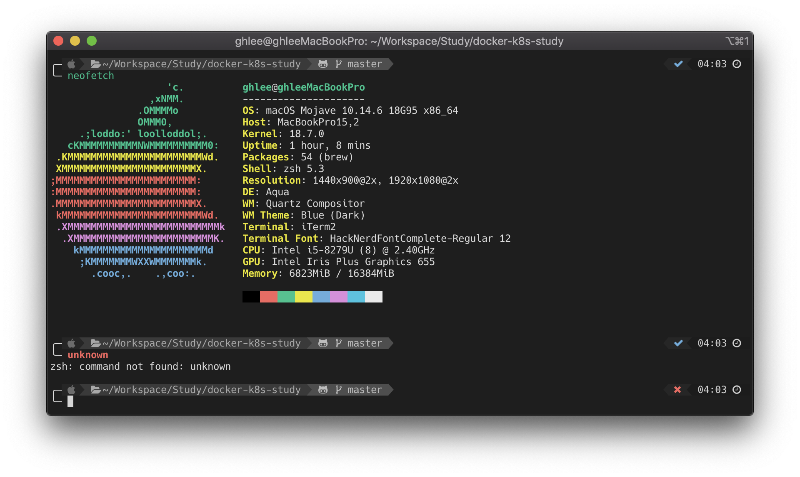

# powerlevel9k-config
💻 My powerlevel9k config

## Preview



## Environment
- OS: `Mac OS`
- Terminal: `iTerm2`
- Shell: `zsh` (+ with oh-my-zsh)

## iTerm Setting
- Theme: [vscode-theme-iterm2](https://github.com/tallpants/vscode-theme-iterm2)
- Font: [Hack Nerd Font](https://github.com/ryanoasis/nerd-fonts/tree/master/patched-fonts/Hack)
  - Size: `Regular, 12`
- Use a different font for non-ASCII text: `Enabled`
- Terminal size
  - Columns: `120`
  - Rows: `30`

## How to apply

1. Copy content `.zshrc` of this repository
2. Paste your `~/.zshrc` on top
3. Apply
```bash
source ~/.zshrc
```
4. Enjoy!
